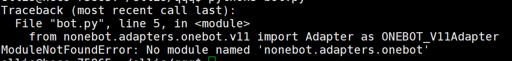

---

title: nonebot2踩坑
date: 2022-07-02 11:05:05
categories:
  - [教练我想学挂边躲牛, QQbot]
tags:
  - QQbot
  - gocqhttp
  - nonebot2
  - nonebot
---

## 关于适配器

#### ModuleNotFoundError: No module named 'nonebot.adapters.onebot'

一开始看到报错二话没想猜测需要nb1，然后把nb1装上，然后烂完了，幸亏有群友帮忙。



安装适配器解决

```
pip install nonebot-adapter-onebot
```

## 同时装有nb1和nb2

当时运行报错ModuleNotFoundError: No module named 'nonebot.log'

两个都卸载，然后安装

```
pip uninstall nonebot
pip uninstall nonebot2
pip uninstall nb-cli
pip install nb-cli
pip install nonebot-adapter-onebot
```

## cqhttp 配置连接

OneBot V11 ws地址改了

```
ws://127.0.0.1:port/onebot/v11/ws/
```


