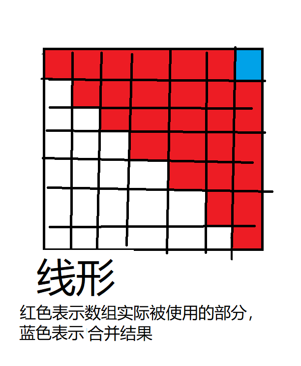
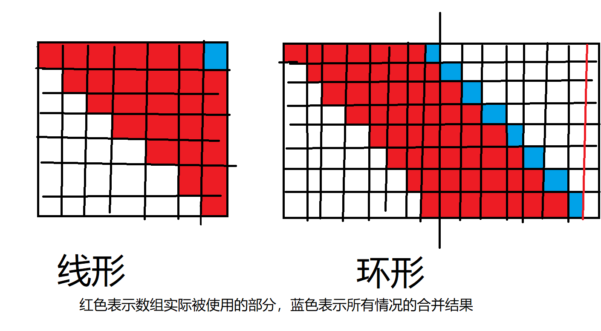

## 说明 - 2022-05-05
本篇博客为本人原创, 原发布于CSDN, 在搭建个人博客后使用爬虫批量爬取并挂到个人博客, 出于一些技术原因博客未能完全还原到初始版本(而且我懒得修改), 在观看体验上会有一些瑕疵 ,若有需求会发布重制版总结性新博客。发布时间统一定为1111年11月11日。钦此。

## 1 线形石子合并

参考题目 <https://www.acwing.com/problem/content/284/>

题目要求最小代价

大致思路为：  
有n组石头排成一条线，  
规定把第i组和第i组合并（自己合并自己），代价为0  
1.求所有相邻的两堆石头合并的代价  
2.求所有相邻的三堆石头合并的代价，之前求出的两堆石头合并的代价可以作为前提  
3.求所有相邻的四堆石头合并的代价，之前求出的两堆石头合并的代价和三堆石头合并的代价都可以作为前提  
…  
n-1.求相邻的n堆石头合并的代价，之前求出的【2，n-1】堆石头合并的代价都可以作为前提

用程序模拟出这个过程便可以求得答案  
.

.

使用二维数组dp记录这些代价，首先令所有的dp[i][i]=0  
使用一维数组sum记录从第一堆石头到第i堆石头的石头总数  
假设要求解dp[4][7] 只需要求  
sum[7]-sum[4-1] + min(dp[4] [4]+dp[5] [7],dp[4] [5]+dp[6] [7],dp[4] [6]+dp[7] [7])  

代码:

​    
​    #include <iostream>
​    #include <cstdio>
​    #include <cstring>
​    #include <algorithm>
​    #include <iomanip>
​    #include <queue>
​    #include <cmath>
​    #include <map>
​    
​    const int N=303;
​    int sum[N],dp[N][N],v[N];
​    
​    int main()
​    {
​        int n;
​        std::cin >> n;
​        std::cin >> v[1];
​        sum[0]=0;
​        sum[1]=v[1];
​        for(int i=2; i<=n; i++)
​        {
​            std::cin >> v[i];
​            sum[i]=sum[i-1]+v[i];
​        }
​        memset(dp,1,sizeof(dp));
​        for(int i=1; i<=n; i++) dp[i][i]=0;
​        for(int span=1; span<n ;span++) 
​        {// span表示区间长度，如span=1表示这次循环求相邻的两堆石头，span=2表示这次循环求相邻的三堆石头，span=n-1表示求所有n堆石头合并的代价
​            for(int st=1; st+span<=n; st++)
​            {//st表示所求区间的起点，ed表示所求区间的终点，st和ed同步增加，直到求完所有合并相邻span+1堆石头的代价
​                int ed=st+span;
​                for(int tmp=st; tmp<ed; tmp++)//tmp为[st,ed)之间的所有整数，这一步循环用来求从st到ed的最小代价
​                    dp[st][ed]=std::min(dp[st][ed],dp[st][tmp]+dp[tmp+1][ed]-sum[st-1]+sum[ed]);
​            }
​        }
​        std::cout << dp[1][n] << std::endl;
​        return 0;
​    }

​    

## 2 环形石子合并

这个知识点是我根据上方线形石子合并自己想的,大概有更优的解法吧

参考题目 <https://www.luogu.com.cn/problem/P1880>

**把环形拆成线形** 把环形的n堆石头从第1堆石头和第n堆石头之间分开,成为线形,然后再把这n堆在一条线上的石头复制一份,加到第n堆石头末尾.  
这样即可模拟以 **每** 一堆石头为起点的 **线形** 石子合并

线形石子合并中for(int st=1; st+span<=n; st++)的st+span<=n是为了把ed限制在ed<=n,现在可以改成st<=n
其他地方基本与线形合并相同

需要注意dp数组的行数没有变成两倍,for(int tmp=st; tmp<ed; tmp++)中如果出现tmp+1>n
若要获取dp[tmp+1][ed]的值,则获取tmp[tmp+1-n][ed-n]的值

  
代码:

​    
​    #include <iostream>
​    #include <cstdio>
​    #include <cstring>
​    #include <algorithm>
​    #include <iomanip>
​    #include <queue>
​    #include <cmath>
​    #include <map>
​    
​    const int N=103;
​    int sum[N<<1],dp[N][N<<1],v[N],pd[N][N<<1];
​    
​    int main()
​    {
​        int n;
​        std::cin >> n;
​        std::cin >> v[1];
​        sum[0]=0;
​        sum[1]=v[1];
​        for(int i=2; i<=n; i++)
​        {
​            std::cin >> v[i];
​            sum[i]=sum[i-1]+v[i];
​        }
​        for(int i=1; i<=n; i++)
​        {
​            sum[i+n]=sum[i+n-1]+v[i];
​        }
​        memset(dp,1,sizeof(dp));
​        memset(pd,0,sizeof(pd));
​        for(int i=1; i<=n; i++)
​        {
​            dp[i][i]=0;
​            pd[i][i]=0;
​        }
​        for(int span=1; span<n ;span++)
​        {
​            for(int st=1; st<=n; st++)
​            {
​                int ed=st+span;
​                for(int tmp=st; tmp<ed; tmp++)
​                {
​                    if(tmp+1>n)
​                    {
​                        dp[st][ed]=std::min(dp[st][ed],dp[st][tmp]+dp[tmp+1-n][ed-n]-sum[st-1]+sum[ed]);
​                        pd[st][ed]=std::max(pd[st][ed],pd[st][tmp]+pd[tmp+1-n][ed-n]-sum[st-1]+sum[ed]);
​                    }
​                    else
​                    {
​                        dp[st][ed]=std::min(dp[st][ed],dp[st][tmp]+dp[tmp+1][ed]-sum[st-1]+sum[ed]);
​                        pd[st][ed]=std::max(pd[st][ed],pd[st][tmp]+pd[tmp+1][ed]-sum[st-1]+sum[ed]);
​                    }
​                }
​            }
​        }
​        int mn=1e9,mx=0;
​        for(int i=1; i<=n; i++)
​        {
​            mn=std::min(dp[i][n+i-1],mn);
​            mx=std::max(pd[i][n+i-1],mx);
​        }
​        std::cout << mn << std::endl << mx;
​        return 0;
​    }

​    

