## 说明 - 2022 - 05 - 06

已经完成人工重置，发布时间设定在1444年11月11日，表示这篇博文写于博客建立之前，并于为重置的远古文章区分。

## ~~说明 - 2022-05-05~~

~~本篇博客为本人原创, 原发布于CSDN, 在搭建个人博客后使用爬虫批量爬取并挂到个人博客, 出于一些技术原因博客未能完全还原到初始版本(而且我懒得修改), 在观看体验上会有一些瑕疵 ,若有需求会发布重制版总结性新博客。发布时间统一定为1111年11月11日。钦此。~~

*自学记录 不专业*

## 001 基础-读取与保存

**读取图像**

 ```python
 #读入图像 cv2.imread(filepath,flags)
 '''
 flags参数的取值：
 cv2.IMREAD_COLOR：默认，载入一个彩色图像，忽略透明度   可用1代替
 cv2.IMREAD_GRAYSCALE：载入一个灰阶图像  可用0代替
 cv2.IMREAD_UNCHANGED：载入一个包含 Alpha 通道（透明度）的图像   可用-1代替
 '''
 img1=cv2.imread('imgs/lx.jpg',0)
 
 ```

**显示图像**

 ```python
 #显示图像   cv2.imshow(wname,img)
 '''
 wname  窗口的名字 window name
 img 要显示的图像 窗口他大小为自动调整图片大小
 '''
 cv2.imshow('lxSHOW',img1)
 key=cv2.waitKey(0)
 cv2.destroyWindow('lxSHOW')
 #cv2.destroyAllWindows()
 if key==27:
     print('Key_ESC has been pressed')
 
 ```


**保存图像**

  ```python
  #保存图像 cv2.imwrite(file，img，num)
  '''
  file 文件名
  img  要保存的图像
  '''
  #其中可选参数num
  '''
  它针对特定的格式：对于JPEG，其表示的是图像的质量，用0 - 100的整数表示，默认95;对于png ,第三个参数表示的是压缩级别。默认为3.
  cv2.IMWRITE_JPEG_QUALITY类型为 long ,必须转换成 int
  cv2.IMWRITE_PNG_COMPRESSION, 从0到9 压缩级别越高图像越小。
  '''
  cv2.imwrite('imgs_save/lxGrey1.jpg',img1,[int(cv2.IMWRITE_JPEG_QUALITY),95])
  cv2.imwrite('imgs_save/lxGrey2.png',img1,[int(cv2.IMWRITE_PNG_COMPRESSION),3])
  # jpg属于有损压缩，是以图片的清晰度为代价的，数字越小，压缩比越高，图片质量损失越严重
  # png属于无损压缩，数字0-9，数字越低，压缩比越低
  
  ```


**读取视频文件**

 ```python
 #读取视频 cv2.VideoCapture()
 '''
 参数为0 : 调用笔记本内置摄像头
 参数为其他数字 : 不是很清楚，尝试用OBS开了个虚拟摄像头参数调成1可以调用
 参数为路径 : 打开视频
 '''
 #检查摄像头初始化是否成功 cv2.VideoCapture.isOpened()
 '''
 成功返回Ture
 '''
 #读取视频的一帧 cv2.VideoCapture.read()
 '''
 每次调用便读取一帧 返回值为 ret,frame
 ret ： 布尔类型，如果正确读取便返回Ture
 frame : 每一帧的图像，三维矩阵
 '''
 #释放摄像头 cv2.VideoCapture.release()
 
 #vd = cv2.VideoCapture('videos/mgm.mkv')
 vd =  cv2.VideoCapture(1)
 if vd.isOpened():
     ret, frame = vd.read()
     #frame = cv2.resize(frame,(1080,720))
 else:
     ret = False
     
 while ret:
     cv2.imshow('TheVideo',frame)
     #利用waitKey设置每一帧的停顿时间 如果你按了ESC(27)则直接退出 
     #显然当waitKey为0时只有按键才会换帧
     if cv2.waitKey(1) & 0xFF == 27:
         break
     ret, frame = vd.read()
     #frame = cv2.resize(frame,(1080,720))
     
 vd.release()
 cv2.destroyAllWindows() 
 
 ```

​    


## 002基础-简单变换

**裁剪**

```python
#图片裁剪
img_cliped = img[100:600,50:1050]

cv2.imshow('Clip', img_cliped)
cv2.waitKey(0)
cv2.destroyWindow('Clip')

```

**改变图片大小**

```python
#图片改变大小 cv2.resize(img,(整形宽，整形高),fx,fy)
'''
可以给出固定的宽高
也可以给(0,0)按倍数变化(fx,fy)
'''
img_resized = cv2.resize(img, (1200,500)) #(宽1200，高500)
img_resized2 = cv2.resize(img, (0,0), fx = 0.4, fy = 0.4)

cv2.imshow('Resize', img_resized)
cv2.imshow('Resize2', img_resized2)
cv2.waitKey(0)
cv2.destroyAllWindows()

```

**改变图片大小-自己实现**

```python
#图片改变大小 自己实现
import numpy as np
import cv2

img=cv2.imread('imgs/lx.jpg',1)
rate=0.4

imgH,imgW,imgN=img.shape
newH,newW,newN=int(imgH*rate),int(imgW*rate),imgN

new=np.zeros((newH,newW,newN),np.uint8)

for i in range(newH):
    for j in range(newW):
        ii=int(i*(imgH*1.0/newH))
        jj=int(j*(imgW*1.0/newW))
        new[i,j]=img[ii,jj]

cv2.imshow('lxRESIZED',new)
#cv2.imshow('lxRESIZED',np.dstack((new[:,:,0],new[:,:,1],new[:,:,2])))
cv2.waitKey(0)
cv2.destroyAllWindows()

```

**图片反转**
    

```python
#图片反转 cv2.flip(img,flipcode)

'''
#flipcode=0 沿x轴翻转
#flipcode>0 沿y轴翻转
#flipcode<0 x,y同时翻转
'''
flipX=cv2.flip(img,0)
flipY=cv2.flip(img,1)
flipXY=cv2.flip(img,-1)

cv2.imshow('lxFLIPx',flipX)
cv2.imshow('lxFLIPy',flipY)
cv2.imshow('lxFLIPxy',flipXY)

cv2.waitKey(0)
cv2.destroyAllWindows()

```

**颜色通道分离与合并**

```python
#颜色通道分离与合并
img = cv2.imread('imgs/sky1.png')
imgC = img.copy()

B,G,R = cv2.split(img)
zero = np.zeros_like(B)
imgC[:,:,1] = 0
imgC[:,:,2] = 0

cv2.imshow('B1',np.dstack((B,zero,zero)))
cv2.imshow('B2',cv2.merge((B,zero,zero)))
cv2.imshow('B3',imgC)

cv2.waitKey(0)
cv2.destroyAllWindows()

```


**cv2.cvtColor 通道转换**

```python
img = cv2.imread('imgs/sky1.png',1)
imgBGR = cv2.cvtColor(img,cv2.COLOR_RGB2BGR)
imgGRAY = cv2.cvtColor(img,cv2.COLOR_RGB2GRAY)
fig, ax = plt.subplots(1,2)
ax[0].imshow(imgBGR)
ax[1].imshow(imgGRAY,cmap = 'gray')
plt.savefig('imgs_save/123.png')
	
```


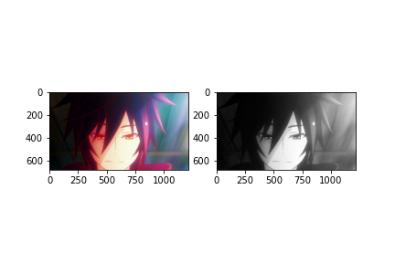

**简单数值计算**

```python
#数值计算
'''
numpy(直接计算) 越界会%256
cv2.add(img1,img2) 越界会保留255
'''
img = cv2.imread('imgs/sky1.png')
another = np.full_like(img,225)
another_img = cv2.add(img,another)
cv2.imshow('Add_50',img+50)
cv2.imshow('Add_80',img+80)
cv2.imshow('another_img',another_img)
cv2.waitKey(0)
cv2.destroyAllWindows()

```


**cv2.addWeighted**

```python
#重叠两张图片
img1 = cv2.imread('imgs/sky1.png')
img2 = cv2.imread('imgs/lx.jpg')
img1_resized = cv2.resize(img1,(img2.shape[1],img2.shape[0]))
img_mix = cv2.addWeighted(img2,0.5,img1_resized,0.5,0)
cv2.imshow('MIX',img_mix)
cv2.imshow('MIX2',cv2.add((img1_resized*0.5).astype(np.int8),(img2*0.5).astype(np.int8))-120)
cv2.waitKey(0)
cv2.destroyAllWindows()
'''
图MIX2手动实现了一下结果太亮了，所以最后-120达到和函数差不多的效果
其中的原因改日探究
'''

```


## 003 基础-用matplotlib画图像

```python
img = cv2.imread('imgs/lx.jpg',1)

#在matplotlib中画出图片 matplotlib.pyplot.imshow(img)
#vc2 是BGR模式，matplotlib.pyplot是RGB模式 所以颜色会不一样
B,G,R = cv2.split(img)
img_rgb = cv2.merge((R,G,B))
plt.imshow(img_rgb)

```


​    

## 004 阈值

> #def threshold(src, thresh, maxval, type, dst=None): 
>  '''
>  设置固定级别的阈值应用于多通道矩阵 
>  例如，将 **灰度图像** 变换二值图像，或去除指定级别的噪声，或过滤掉过小或者过大的像素点； 
>  Argument: 
>  src: 原图像 
>  dst: 目标图像 
>  thresh: 阈值 
>  type: 指定阈值类型；下面会列出具体类型； 
>  maxval: 当type指定为THRESH_BINARY或THRESH_BINARY_INV时，需要设置该值； 
>  '''


```python
gray = cv2.imread('imgs/sky1.png',0)
thresh = 127
maxval = 255
#以阈值分割二值化为0和maxval 
ret, threshed1 = cv2.threshold(gray,thresh,maxval,cv2.THRESH_BINARY)      

#以阈值分割二值化为0和maxval
ret, threshed2 = cv2.threshold(gray,thresh,maxval,cv2.THRESH_BINARY_INV)  

#小于阈值变为0
ret, threshed3 = cv2.threshold(gray,thresh,maxval,cv2.THRESH_TOZERO)      

#大于阈值变为0
ret, threshed4 = cv2.threshold(gray,thresh,maxval,cv2.THRESH_TOZERO_INV)  

#大于阈值变为阈值
ret, threshed5 = cv2.threshold(gray,thresh,maxval,cv2.THRESH_TRUNC)      

```


用matplotlib画图

```python
fig, ax = plt.subplots(3,2,figsize = (10,10))
ax[0,0].imshow(threshed1,cmap = 'gray')
ax[0,1].imshow(threshed2,cmap = 'gray')
ax[1,0].imshow(threshed3,cmap = 'gray')
ax[1,1].imshow(threshed4,cmap = 'gray')
ax[2,0].imshow(threshed5,cmap = 'gray')
ax[2,1].imshow(gray,cmap = 'gray')

```


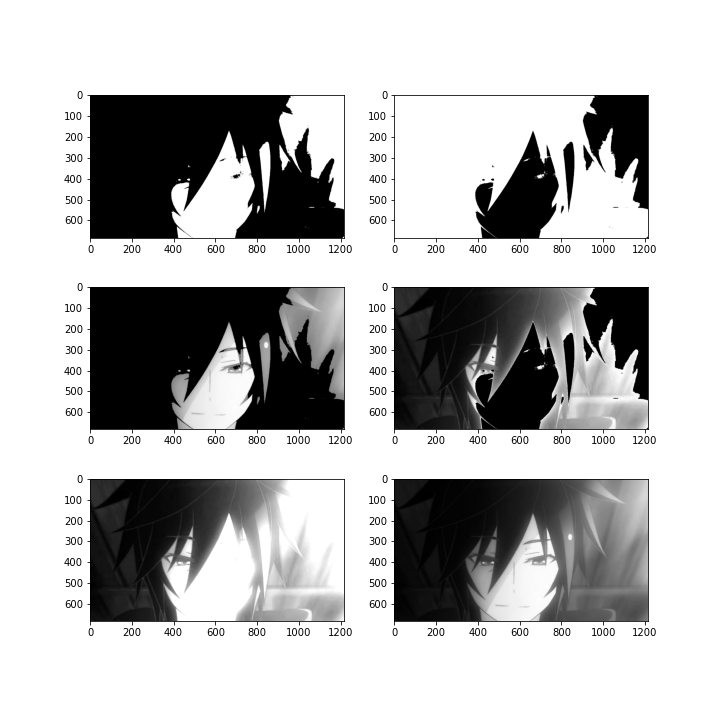

## 005 平滑/模糊处理 // 滤波


```python
img = cv2.imread('imgs/sky1.png',1)
lst = []
name = ['blur','boxFilter','GaussianBlur','madianBlur']

#均值滤波
lst.append( cv2.blur(img,(19,19))                             )

#方框滤波 当normallize为True时等同于均值滤波
lst.append( cv2.boxFilter(img,-1,(19,19),normalize = False)   )

#高斯滤波
lst.append( cv2.GaussianBlur(img,(19,19),sigmaX = 864)        )

#中值滤波
lst.append( cv2.medianBlur(img,19)                            )

lst_save = lst.copy()

for i in range(len(lst)):
    b,g,r = cv2.split(lst[i])
    lst[i] = cv2.merge((r,g,b))

```

用matplotlib画图

```python
fig, ax = plt.subplots(2,2,figsize = (10,7))
for i in range(len(lst)):
    ax[i//2,i%2].imshow(lst[i])
    ax[i//2,i%2].set_title(name[i])
plt.savefig('imgs_save/blur.png')

```


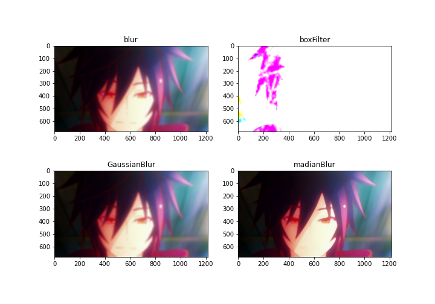

## 006 形态学-腐蚀/膨胀 开/闭/梯度运算

形态学操作一般作用于 **二值化图** ，来连接相邻的元素或分离成独立的元素

**腐蚀** erode：找局部最小 
图像与核卷积，找核覆盖范围内最小值

**膨胀** dilate：找局部最大 
图像与核卷积，找核覆盖范围内最大值
    

```python
img = cv2.imread('imgs/plainstar.png',0)
#fig,ax = plt.subplots(2,1,figsize = (8,12))

kernel = np.ones([3,3],dtype = np.int8)#卷积核
'''
以kernel作为卷积核
参数iterations为迭代次数，iterations=2 代表进行两次腐蚀
'''
erosion = cv2.erode(img,kernel,iterations = 2)
#ax[0].imshow(erosion,cmap = 'gray')

dilation_after_erosion = cv2.dilate(erosion,kernel,iterations = 2)
#ax[1].imshow(dilation_after_erosion,cmap = 'gray')

tot = np.vstack([img,erosion,dilation_after_erosion])
cv2.imwrite('imgs_save/plainstar_open.png',tot)

```

原图+腐蚀图+腐蚀图的膨胀图： 
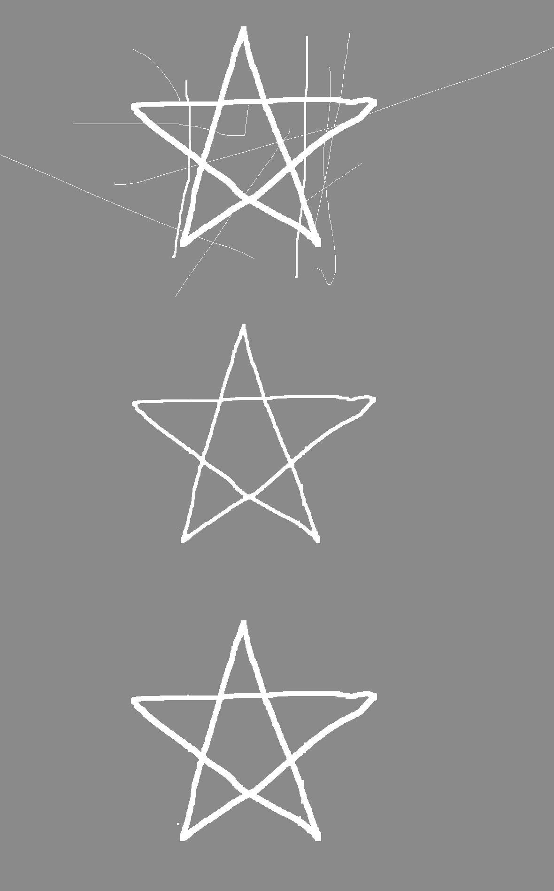

**开运算** ：先腐蚀后膨胀 
**闭运算** ：先膨胀后腐蚀 
上方腐蚀与膨胀的示例代码就是一个开运算，下方代码时开运算+闭运算
    

```python
img = cv2.imread('imgs/plainstar.png',0)
kernel = np.ones([5,5],dtype = np.int8)#卷积核
'''
以kernel作为卷积核
参数cv2.MORPH_OPEN表示开运算
参数cv2.MORPH_CLOSE表示闭运算
'''
opening = cv2.morphologyEx(img,cv2.MORPH_OPEN,kernel)
closing = cv2.morphologyEx(img,cv2.MORPH_CLOSE,kernel)

tot = np.vstack([opening,closing])
cv2.imwrite('imgs_save/plainstar_opening_and_closing.png',tot)

```

开运算与闭运算效果： 
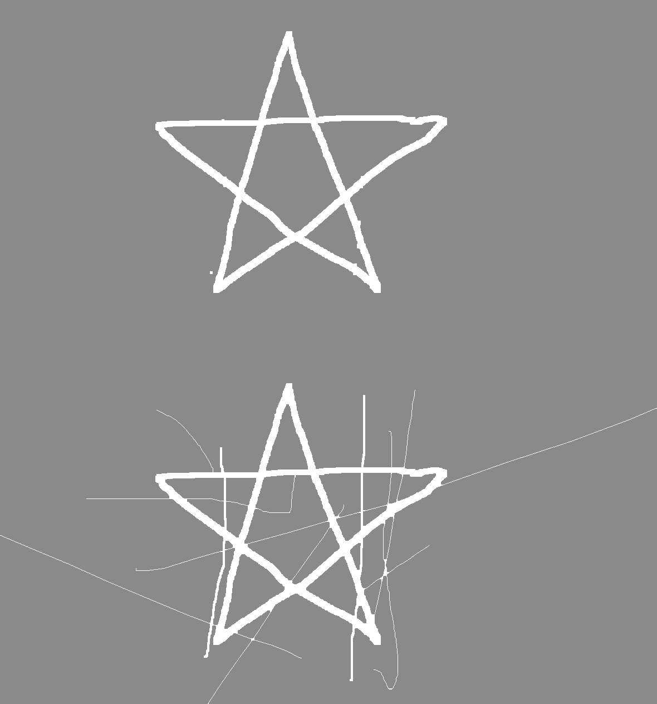 
**梯度运算** ：膨胀-腐蚀

```python
img = cv2.imread('imgs/cloud.png')
kernel = np.ones([5,5],dtype = np.int8)#卷积核
'''
梯度运算：膨胀-腐蚀
参数cv2.MORPH_GRADIENT代表梯度运算
'''
gradient = cv2.morphologyEx(img,cv2.MORPH_GRADIENT,kernel)

tot = np.vstack([img,gradient])
cv2.imwrite('imgs_save/cloud_gradient.png',tot)

```

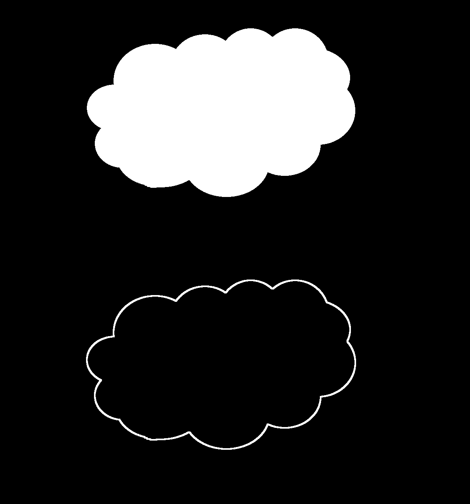 
刚才的五角星进行梯度运算 
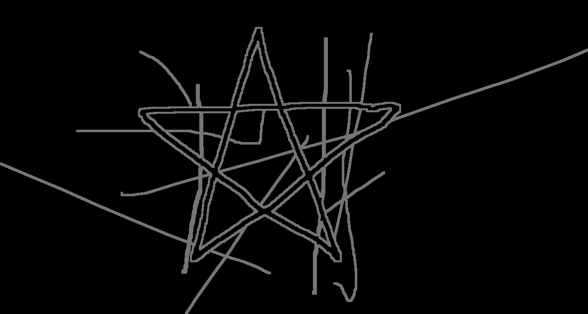

## 007 梯度处理/边缘检测/轮廓检测

**sobel算子梯度处理**

> cv2.Sobel(src, ddepth, dx, dy[, dst[, ksize[, scale[, delta[,
> borderType]]]]])
>
> * * *
>
> 前四个是必须的参数： 
>  第一个参数是需要处理的图像； 
>  第二个参数是图像的深度，-1表示采用的是与原图像相同的深度。目标图像的深度必须大于等于原图像的深度； 
>  dx和dy表示的是求导的阶数，0表示这个方向上没有求导，一般为0、1、2。 
>  其后是可选的参数：
>
> * * *
>
> ksize是Sobel算子的大小，必须为1、3、5、7。 
>  scale是缩放导数的比例常数，默认情况下没有伸缩系数； 
>  delta是一个可选的增量，将会加到最终的dst中，同样，默认情况下没有额外的值加到dst中； 
>  borderType是判断图像边界的模式。这个参数默认值为cv2.BORDER_DEFAULT。

> cv2.addWeighted(src1, alpha, src2, beta, gamma[, dst[, dtype]])
>
> * * *
>
> 可以用来合并两个方向的梯度图

> cv2.convertScaleAbs(src[, dst[, alpha[, beta]]])
>
> * * *
>
>
> Sobel函数求完导数后会有负值，还有会大于255的值,所以需要更大的数据类型（所以为什么深度的参数填的是数据类型？？？），最后用convertScaleAbs()函数将其转回原来的uint8形式

存疑⬆

```python
cloud = cv2.imread('imgs/sky1.png',0)
cloud = cv2.resize(cloud,(0,0),fx = 0.3,fy = 0.3)

cloudX = cv2.Sobel(cloud,cv2.CV_64F,1,0)
cloudY = cv2.Sobel(cloud,cv2.CV_64F,0,1)

cloudAbsX = cv2.convertScaleAbs(cloudX)
cloudAbsY = cv2.convertScaleAbs(cloudY)

cloudXY = cv2.addWeighted(cloudX,0.5,cloudY,0.5,0)
cloudAbsXY = cv2.addWeighted(cloudAbsX,0.5,cloudAbsY,0.5,0)

tot = np.hstack([np.vstack([cloud,cloudX,cloudY,cloudXY]), np.vstack([cloud,cloudAbsX,cloudAbsY,cloudAbsXY])])
cv2.imshow('tot',tot)
cv2.waitKey(0)
cv2.destroyAllWindows()
cv2.imwrite('imgs_save/cloud_grad.png',tot)

```

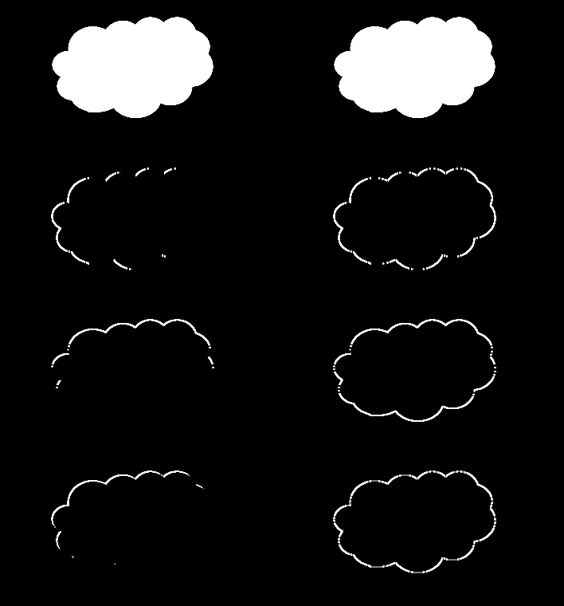  
此外还查到scharr算子laplacian算子 没有深入了解

**Canny边缘检测**  
原理（查资料）：<https://www.cnblogs.com/techyan1990/p/7291771.html>

```python
town = cv2.imread('imgs/town.jpg',0)
town = cv2.resize(town,(0,0),fx = 0.3,fy = 0.3)

'''
见canny双阈值检测
后两个参数表示最小梯度minval、最大梯度maxval
if   梯度 >= maxval 则视为边界
elif 梯度 <= maxval 则不视为边界
elif maxval > 梯度 > minval:
    if   这里与边界相连, 视为边界
    else 不视为边界
'''
canny1 = cv2.Canny(town,80,130)
canny2 = cv2.Canny(town,105,155)
canny = np.hstack((canny1,canny2))
cv2.imwrite('imgs_save/town_canny1.png',canny)

```

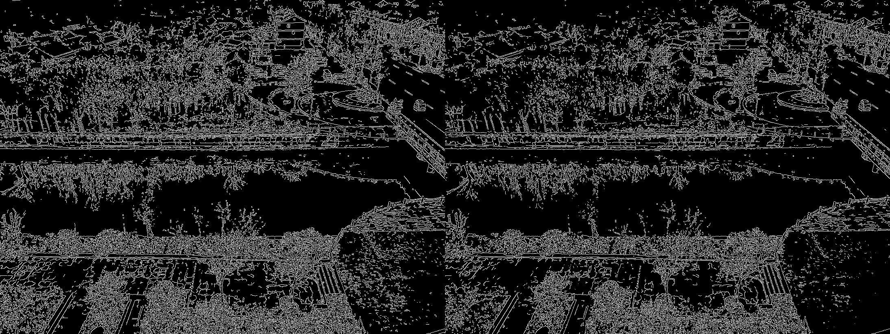  
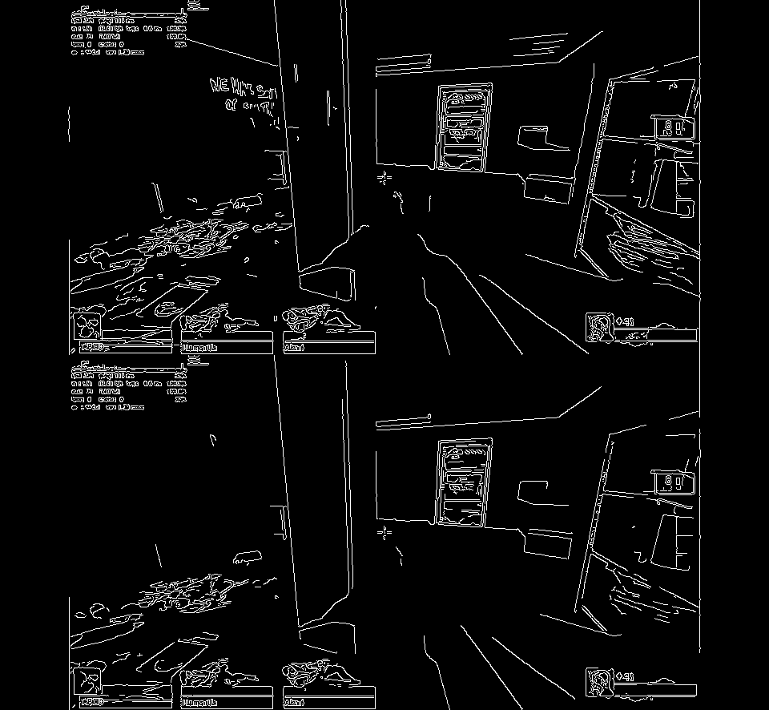  
**轮廓检测**

```python
img = cv2.imread('imgs/mountain.png')
gray = cv2.cvtColor(img,cv2.COLOR_BGR2GRAY)
ret, binary = cv2.threshold(gray,176,255,cv2.THRESH_BINARY)

#轮廓检测
#contours,hierarchy = cv2.findContours(image, mode, method[, contours[, hierarchy[, offset ]]])  
'''
参数：
    mode 
        cv2.RETR_EXTERNAL 表示只检测外轮廓
        cv2.RETR_LIST 检测的轮廓不建立等级关系
        cv2.RETR_CCOMP 建立两个等级的轮廓，上面的一层为外边界，里面的一层为内孔的边界信息。如果内孔内还有一个连通物体，这个物体的边界也在顶层。
        cv2.RETR_TREE 建立一个等级树结构的轮廓。
    method
        cv2.CHAIN_APPROX_NONE 存储所有的轮廓点，相邻的两个点的像素位置差不超过1，即max（abs（x1-x2），abs（y2-y1））==1
        cv2.CHAIN_APPROX_SIMPLE 压缩水平方向，垂直方向，对角线方向的元素，只保留该方向的终点坐标，例如一个矩形轮廓只需4个点来保存轮廓信息
        cv2.CHAIN_APPROX_TC89_L1，CV_CHAIN_APPROX_TC89_KCOS 使用teh-Chinl chain 近似算法
返回值：
    contours   是列表，其中每个元素都是图像中的一个轮廓，用numpy中的ndarray表示
    hierarchy  是一个ndarray，其中的元素个数和轮廓个数相同，每个轮廓contours[i]对应4个hierarchy元素hierarchy[i][0] ~hierarchy[i][3]，
               分别表示后一个轮廓、前一个轮廓、父轮廓、内嵌轮廓的索引编号，如果没有对应项，则该值为负数。
'''
contour, hierarchy= cv2.findContours(binary,cv2.RETR_TREE,cv2.CHAIN_APPROX_NONE)

#画轮廓
#cv2.drawContours(image, contours, contourIdx, color[, thickness[, lineType[, hierarchy[, maxLevel[, offset ]]]]])
'''
参数：
    image 绘制轮廓的图片 注意函数会在image原图上直接作修改
    contours 轮廓
    contourIdx 要绘制的轮廓的编号，-1为绘制所有
    color 绘制轮廓用的颜色
    thickness 线条宽度
'''
con = cv2.drawContours(img.copy(),contour,0,(255,0,255),4)
cv2.imshow('ss',con)
cv2.waitKey(0)
cv2.destroyAllWindows()

```

**轮廓近似**

   ```python
   #轮廓近似
   x = contour[0]
   epsilon1 = 0.05*cv2.arcLength(x,True)  #计算轮廓周长
   epsilon2 = 0.1*cv2.arcLength(x,True)   #计算轮廓周长
   '''
   cv2.approxPolyDP()中给出一个轮廓contour和阈值epsilon
   '''
   approx1 = cv2.approxPolyDP(x,epsilon1,True)
   approx2 = cv2.approxPolyDP(x,epsilon2,True)
   
   
   '''
   实测第二个参数形如approx结果只能在图上点点，若形如[approx]结果为点加连线
   '''
   con = cv2.drawContours(img.copy(),[approx1],-1,(255,0,255),5)
   cv2.imshow('ss',con)
   cv2.waitKey(0)
   cv2.destroyAllWindows()
   cv2.imwrite('imgs_save/mountain+contour1.png',con)
   con = cv2.drawContours(img.copy(),[approx2],-1,(255,0,255),5)
   cv2.imshow('ss',con)
   cv2.waitKey(0)
   cv2.destroyAllWindows()
   cv2.imwrite('imgs_save/mountain+contour2.png',con)
   
   ```


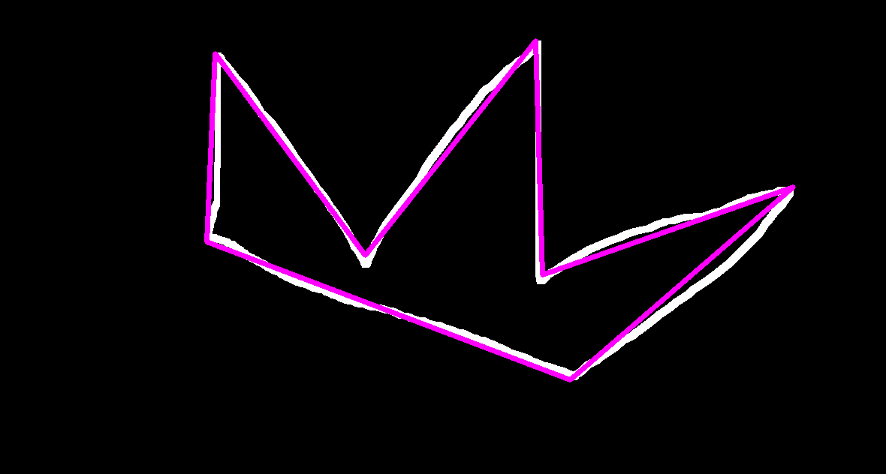  
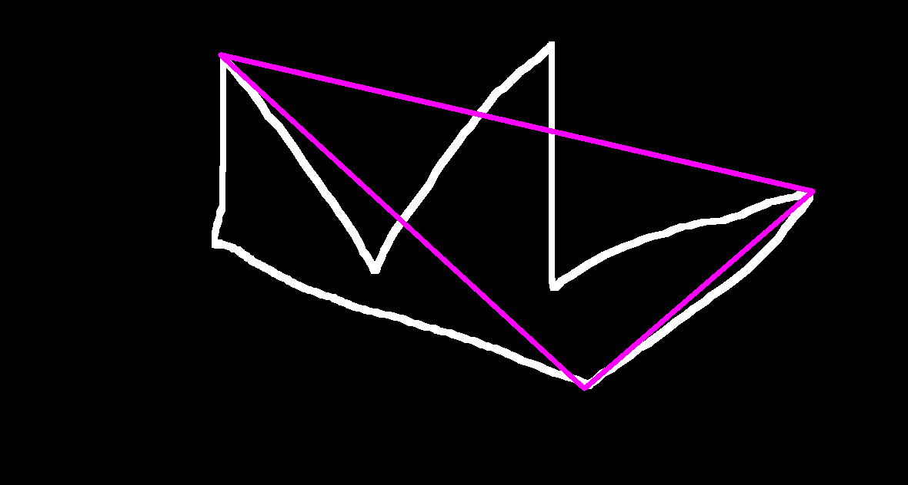  
资料很多都是cpp的暂时不明白最后一个 参数是干嘛的，一下为True(左)和False(右)的对比  
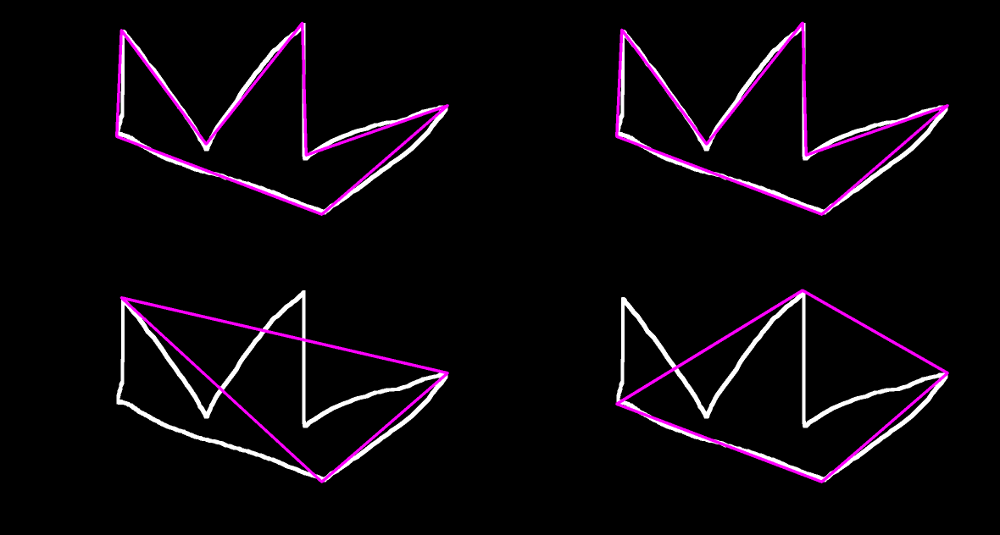

## 008 模板匹配

参考资料：  
<http://www.opencv.org.cn/opencvdoc/2.3.2/html/doc/tutorials/imgproc/histograms/template_matching/template_matching.html>

<https://www.cnblogs.com/ssyfj/p/9271883.html>

<https://www.cnblogs.com/jiyanjiao-702521/p/10471032.html>

```python
method = [cv2.TM_CCOEFF,cv2.TM_CCOEFF_NORMED, cv2.TM_CCORR, cv2.TM_CCORR_NORMED, cv2.TM_SQDIFF, cv2.TM_SQDIFF_NORMED]
lst = []
re = []

#获得match结果矩阵
for i in range(len(method)):
    match = cv2.matchTemplate(img,template,method[i])
    lst.append(match)
#找到最优匹配位置并画方框
for i in range(len(method)):
    min_val,max_val,min_loc,max_loc = cv2.minMaxLoc(lst[i])
    TL = min_loc if method[i] in [cv2.TM_SQDIFF, cv2.TM_SQDIFF_NORMED] else max_loc
    BR = TL[0]+template.shape[1] , TL[1]+template.shape[0]
    tt = img.copy()
    cv2.rectangle(tt,TL,BR,(0,255,0),2)
    re.append(tt)

#储存
fi = np.vstack(re)
fi = cv2.resize(fi,(0,0),fx = 0.45, fy = 0.45)
cv2.imwrite('imgs_save/chess_rec+\'str(cnt)+\'.png',fi)
```

模板  
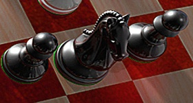  
结果  


## 009 直方图

**获得直方图数据  
直方图均衡化**

**获得直方图数据**
    

```python
#得到直方图数据
#cv2.calcHist(images, channels, mask, histSize, ranges[, hist[, accumulate ]])
'''
imaes:输入的图像
channels:选择图像的通道
mask:掩膜，是一个大小和image一样的np数组，其中把需要处理的部分指定为1，不需要处理的部分指定为0，一般设置为None，表示处理整幅图像
histSize:使用多少个bin(柱子)，一般为256
ranges:像素值的范围，一般为[0,255]表示0~255
后面两个参数基本不用管。
注意，除了mask，其他四个参数都要带[]号

返回值为hist，直方图；接着使用
matplotlib.pyplot.plot(hist,color)进行绘制
'''

gray = cv2.resize(cv2.imread('imgs/InLab1.jpg',0),(0,0),fx = 0.2,fy = 0.2)
img = cv2.resize(cv2.imread('imgs/InLab1.jpg'),(0,0),fx = 0.2,fy = 0.2)

hist = cv2.calcHist([gray],[0],None,[256],[0,256])
plt.plot(hist)
plt.savefig('imgs_save/InLab1_0.2_zhifangtuGRAY.png')

color = ('b','g','r')
for i,each in enumerate(color):
    hist = cv2.calcHist([img],[i],None,[256],[0,256])
    plt.plot(hist,color = each)
plt.savefig('imgs_save/InLab1_0.2_zhifangtuRGB.png')

```

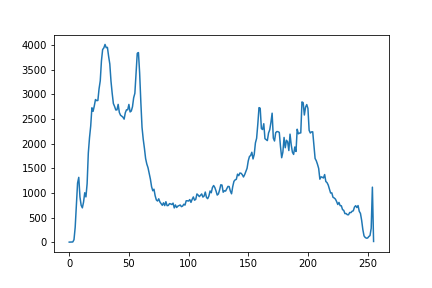  
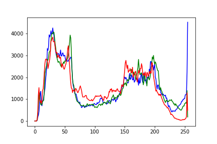  
**直方图均衡化**  
原理（大概）:从小到大，像素依次变为像素的积累概率（这个像素以及比这个像素小的像素出现的总概率）*最大-最小？（255-0)  
1.全局均衡化

```python
#直方图均衡化
#cv2.equalizeHist(img)
'''
要求是灰度图
'''
equalized = cv2.equalizeHist(gray)
#both = np.hstack([gray,equalized])
cv2.imshow('asdf',both)
cv2.waitKey(0)
cv2.destroyAllWindows()

```


2.限制对比度自适应直方图均衡 CLAHE算法

```python
#自适应均衡化 分块+调整让块与块之间看起来没有界限
'''
clipLimit参数表示对比度的大小。
tileGridSize参数表示每次处理块的大小 。
'''
clahe = cv2.createCLAHE(clipLimit=2.0, tileGridSize=(8,8))
clahed = clahe.apply(gray)

```


效果： 1 灰度图原图 . 2全局均衡化 3.CLAHE  
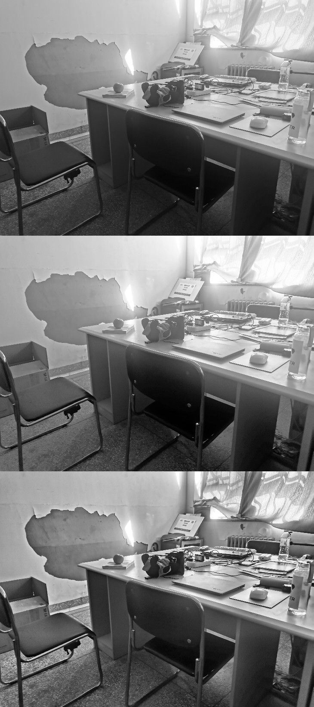

