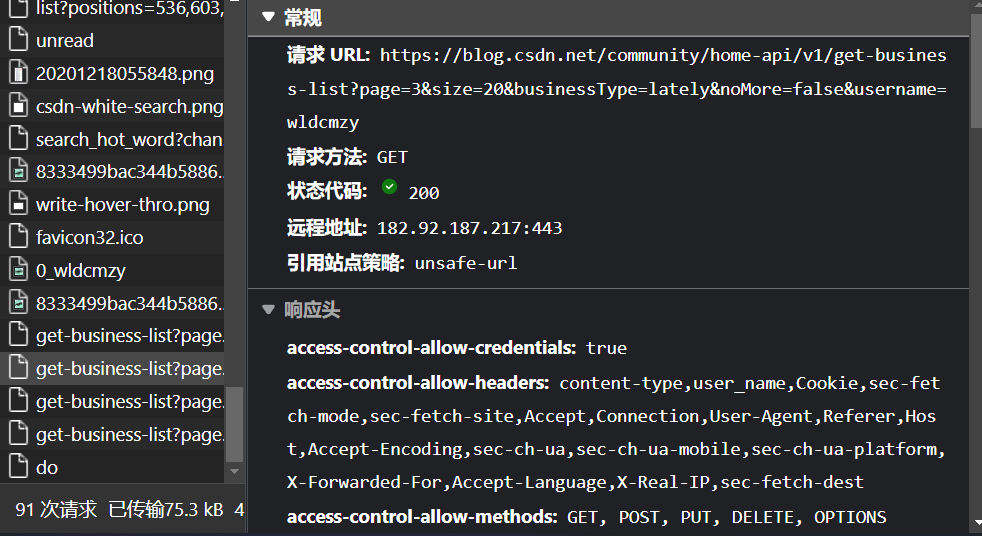

## 1.先考虑怎么获得自己所有博客的地址

a.打开自己的个人博客，尝试从HTML里提取有用信息，没能成功。

b.发现下滑后动态加载自己的博客，于是抓包，找到连接



c.发现连接中除了page=%d这一部分外，其余都相同，所以考虑使用for循环请求多个连接，并在返回数据中提取网址

```python
import requests
import re

N = 6
idname = 'wldcmzy'

headers = {
    'User-Agent': 'Mozilla/5.0 (Windows NT 10.0; Win64; x64) AppleWebKit/537.36 (KHTML, like Gecko) Chrome/101.0.4951.41 Safari/537.36 Edg/101.0.1210.32'
}
url_base = 'https://blog.csdn.net/community/home-api/v1/get-business-list?page={page}&size=20&businessType=lately&noMore=false&username={name}'.format(page = '{page}', name = idname)

lst = []
for i in range(1, N):
    res = requests.get(url_base.format(page = i), headers = headers)
    lst.extend(re.findall("https://blog.csdn.net/%s/article/details/[0-9]+" % idname, res.text))


```

## 2.写抓取博文的代码

由于本人太菜了，没有成功吧博文提取出来，所以去网上搜索到了[一篇大佬的文章](https://blog.csdn.net/haojie_duan/article/details/122864466)，这篇文章是爬取CSDN热门文章的，可以复制源码略加改动，打到爬自己博文的目的

中间还是遇到了一些错误的，毕竟自己的需求和原文有所不同，比如大佬的代码里没有处理特殊字符\t，以及使用BeautifSoup检索标签时需要在class_参数中加上"markdown_views prism-atom-one-dark"。这些问题可以很快被发现并且修正。

附上改后的代码:

```python
"""
@Author:survive
@Blog(个人博客地址): https://blog.csdn.net/haojie_duan
 
@File:csdn.py.py
@Time:2022/2/10 8:49
 
@Motto:我不知道将去何方，但我已在路上。——宫崎骏《千与千寻》

代码思路：
1.确定目标需求:将csdn文章内容保存成 html、PDF、md格式
    - 1.1首先保存为html格式：获取列表页中所有的文章ur1地址，请求文章ur1地址获取我们需要的文章内容
    - 1.2 通过 wkhtmitopdf.exe把html文件转换成PDF文件
    - 1.3 通过 wkhtmitopdf.exe把html文件转换成md文件

2.请求ur1获取网页源代码
3.解析数据，提取自己想要内容
4.保存数据
5.转换数据类型把HTML转换成PDF、md文伴
"""


html_str = """
<!DOCTYPE html>
<html lang="en">
<head>
    <meta charset="UTF-8">
    <title>Document</title>
</head>
<body>
{article}
</body>
</html>
"""

import requests
import parsel
#import pdfkit   #用来将html转为pdf
import re
import os
import urllib.parse
from bs4 import BeautifulSoup
import html2text    #用来将html转换为md
import random

# user_agent库：每次执行一次访问随机选取一个 user_agent，防止过于频繁访问被禁止
USER_AGENT_LIST = [
    "Mozilla/5.0 (Windows NT 6.1; WOW64) AppleWebKit/537.1 (KHTML, like Gecko) Chrome/22.0.1207.1 Safari/537.1",
    "Mozilla/5.0 (X11; CrOS i686 2268.111.0) AppleWebKit/536.11 (KHTML, like Gecko) Chrome/20.0.1132.57 Safari/536.11",
    "Mozilla/5.0 (Windows NT 6.1; WOW64) AppleWebKit/536.6 (KHTML, like Gecko) Chrome/20.0.1092.0 Safari/536.6",
    "Mozilla/5.0 (Windows NT 6.2) AppleWebKit/536.6 (KHTML, like Gecko) Chrome/20.0.1090.0 Safari/536.6",
    "Mozilla/4.0 (compatible; MSIE 7.0; Windows NT 5.1; 360SE)",
    "Mozilla/5.0 (Windows NT 6.1; WOW64) AppleWebKit/536.3 (KHTML, like Gecko) Chrome/19.0.1061.1 Safari/536.3",
    "Mozilla/5.0 (Windows NT 6.1) AppleWebKit/536.3 (KHTML, like Gecko) Chrome/19.0.1061.1 Safari/536.3",
    "Mozilla/5.0 (Windows NT 6.2) AppleWebKit/536.3 (KHTML, like Gecko) Chrome/19.0.1061.0 Safari/536.3",
    "Mozilla/5.0 (X11; Linux x86_64) AppleWebKit/535.24 (KHTML, like Gecko) Chrome/19.0.1055.1 Safari/535.24",
    "Mozilla/5.0 (Windows NT 6.2; WOW64) AppleWebKit/535.24 (KHTML, like Gecko) Chrome/19.0.1055.1 Safari/535.24"
    "Mozilla/5.0 (Windows NT 10.0; Win64; x64) AppleWebKit/537.36 (KHTML, like Gecko) Chrome/98.0.4758.82 Safari/537.36"
]

class CSDNSpider():
    def __init__(self, lst):
        self.url = 'https://blog.csdn.net/csdndevelopers/category_10594816.html'
        self.headers = {
            'user-agent':random.choice(USER_AGENT_LIST)
        }
        
        self.lst = lst

    def send_request(self, url):
        response = requests.get(url=url, headers=self.headers)
        response.encoding = "utf-8"
        if response.status_code == 200:
            return response

    def parse_content(self, reponse):
        html = reponse.text
        selector = parsel.Selector(html)
        href = selector.css('.column_article_list a::attr(href)').getall()
        name = 00
        for link in href:
            print(link)
            name = name + 1
            # 对文章的url地址发送请求
            response = self.send_request(link)
            if response:
                self.parse_detail(response, name)

    def parse_detail(self, response, name):
        html = response.text
        # print(html)
        selector = parsel.Selector(html)
        title = selector.css('#articleContentId::text').get()
        # content = selector.css('#content_views').get()

        # 由于这里使用parsel拿到的网页文件，打开会自动跳转到csdn首页，并且不能转为pdf，就想在这里用soup
        soup = BeautifulSoup(html, 'lxml')
        with open('debugdir/' + str(name) + '.css', 'w') as f:
            f.write(str(soup))
        #print(soup)
        content = soup.find('div',id="content_views",class_=["markdown_views prism-atom-one-dark", "markdown_views prism-atom-one-light" , "htmledit_views"]) #class_="htmledit_views"
        print(content)
        # print(content)
        # print(title, content)
        html = html_str.format(article=content)
        self.write_content(html, title)

    def write_content(self, content, name):

        print(name)

        html_path = "HTML/" + str(self.change_title(name)) + ".html"
        pdf_path ="PDF/" + str(self.change_title(name))+ ".pdf"
        md_path = "MD/" + str(self.change_title(name)) + ".md"

        # 将内容保存为html文件
        with open(html_path, 'w',encoding="utf-8") as f:
            f.write(content)
            print("正在保存", name, ".html")

        # 将html文件转换成PDF文件
        #config = pdfkit.configuration(wkhtmltopdf=r'G:\Dev\wkhtmltopdf\bin\wkhtmltopdf.exe')
        #pdfkit.from_file(html_path, pdf_path, configuration=config)
        #print("正在保存", name, ".pdf")
        # os.remove(html_path)

        # 将html文件转换成md格式
        html_text = open(html_path, 'r', encoding='utf-8').read()
        markdown = html2text.html2text(html_text)
        with open(md_path, 'w', encoding='utf-8') as file:
            file.write(markdown)
            print("正在保存", name, ".md")

    def change_title(self, title):
        mode = re.compile(r'[\\\/\:\?\*\"\<\>\|\!\t]')
        new_title = re.sub(mode,'_', title)

        return new_title

    def start(self):
        #response = self.send_request(self.url)
        #if response:
        #    self.parse_content(response)
        for i, link in enumerate(self.lst):
            print(i + 1, link)
            response = self.send_request(link)
            if response:
                 self.parse_detail(response, i)


if __name__ == '__main__':
    csdn = CSDNSpider(lst)
    csdn.start()


```

## 3.效果

虽然得到了所有博客的md文件，整体效果稍微差一点，比如代码框没有代码类型，代码框中回车较多会被截成好几份等，但是也可以接受
